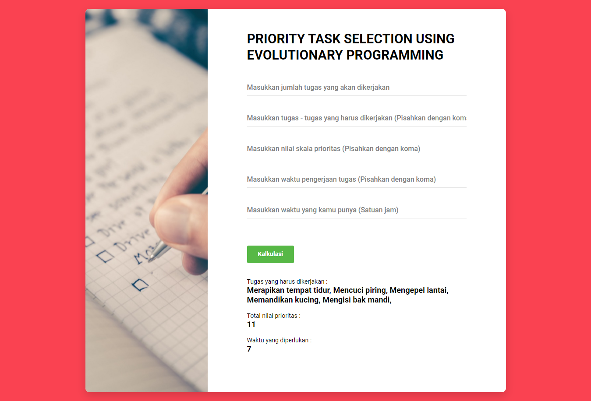

# Priority-Task-Selection-Using-Evolutionary-Programming

A program to calculate the tasks that we can prioritize to do by determining them using <b>Evolutionary Programming</b> algorithm.

<!-- TABLE OF CONTENTS -->
<details open="open">
  <summary>Table of Contents</summary>
  <ol>
    <li><a href="#description">About The Project</a><li>
      <a href="#getting-started">Getting Started</a>
      <ul>
        <li><a href="#dependencies">Dependencies</a></li>
        <li><a href="#executing-program">Executing program</a></li>
      </ul>
    </li>
    <li><a href="#screenshots">Screenshots</a></li>
    <li><a href="#authors">Authors</a></li>
    <li><a href="#version-history">Version History</a></li>
    <li><a href="#license">License</a></li>
    <li><a href="#acknowledgments">Acknowledgments</a></li>
  </ol>
</details>

## Description

This is a program to calculate the tasks that we can prioritize to do by determining them using <b>Evolutionary Programming</b> algorithm. This program is a web-based platform, created with Flask using Python programming language.

## Getting Started

### Dependencies

* Flask
* Numpy

### Executing program

1. Open CMD in Repository Folder
2. Run Flask by executing this command :
```
python app.py
```
or :
```
run Flask
```
3. Open Given URL (Usually "127.0.0.1:5000")
4. There are 5 inputs :

    - First input : Total tasks
    - Second input : All tasks name (Must be sorted according to first input)
    - Third input : All tasks priority number (You can use 1 until 4, 1 for the lowest prioritize and 4 for the highest prioritize)
    - Fourth input : All tasks time required (You can use hour time based)
    - Fifth input : Time you have (Must use the same time based with All tasks time required)

    Inputs example :
    - First input : 10
    - Second input : Merapikan tempat tidur, Mencuci piring, Menyuci baju, Menyetrika baju,  Mengepel lantai, Menyiram tanaman, Memandikan kucing, Mengisi bak mandi, Mengurus anak, Merapikan barang-barang
    - Third input : 4, 3, 3, 2, 2, 1, 1, 1, 3, 2
    - Fourth input : 1, 2, 3, 2, 2, 1, 1, 1, 3, 2
    - Fifth input : 8

## Screenshots



## Authors

* Linggar Maretva Cendani - [Linggar Maretva Cendani](https://linggar.me) - [linggarmc@gmail.com](mailto:linggarmc@gmail.com)

## Version History

* 0.1
    * Initial Release

## License

This project is licensed under the MIT License - see the [LICENSE](LICENSE) file for details

## Acknowledgments

* [Colorlib](https://colorlib.com/) for HTML templates
